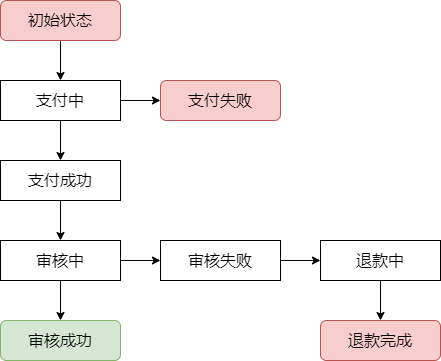
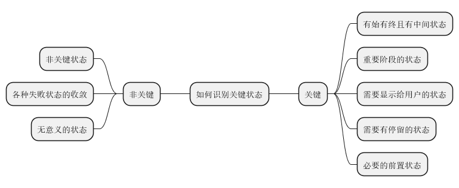

# 有限状态机在金融业务中的应用

## 1. 有限状态机

本质是描述对象生命周期内的状态序列，由事件引起并伴随着动作而转移的过程。

在支付系统中，状态机管理着每笔交易的生命周期，
确保交易在正确的状态，受到正确的事件驱动到下一个正确的状态上。

## 1.1 基本原则

业务对象不同，如何定义有哪些**状态**？
业务流程不同，如何确定有哪些**事件**？

* 明确性：状态和事件必须清晰明确
* 完备性：为所有可能的事件-状态组合定义动作逻辑
* 最小化：避免不必要的复杂
* 不可逆：状态转移由事件驱动且不可逆
* 无环有界：避免状态循环且一定能流传至终态

## 1.2 识别关键状态

## 1.3 状态机涉及系统设计点

1. 状态补偿
2. 支持状态重入
3. 状态流转时使用乐观锁校验前置状态，从而避免并发
4. 检测长时间停留状态
5. 状态枚举阶段+事务

## 2. 代码实现

* 分离状态和处理逻辑：使用状态模式，将每个状态的行为封装在各自的类中
* 使用事件驱动模型：通过事件来触发状态流转
* 确保可追踪性：状态转换能被记录和追踪
